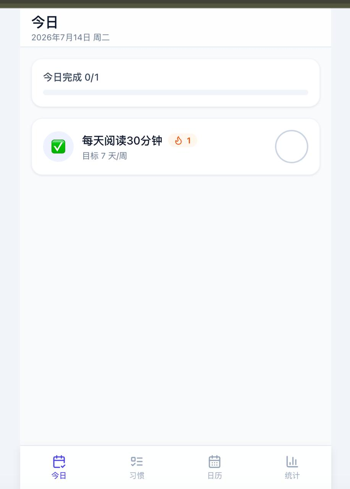
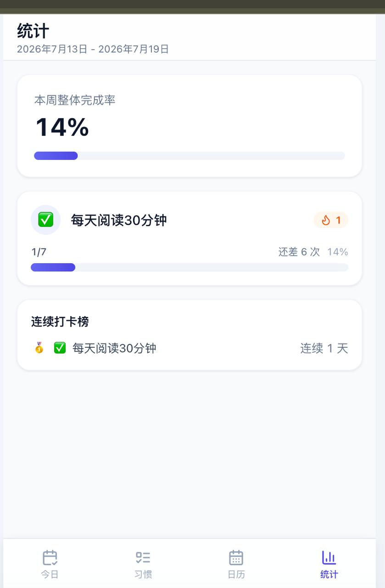
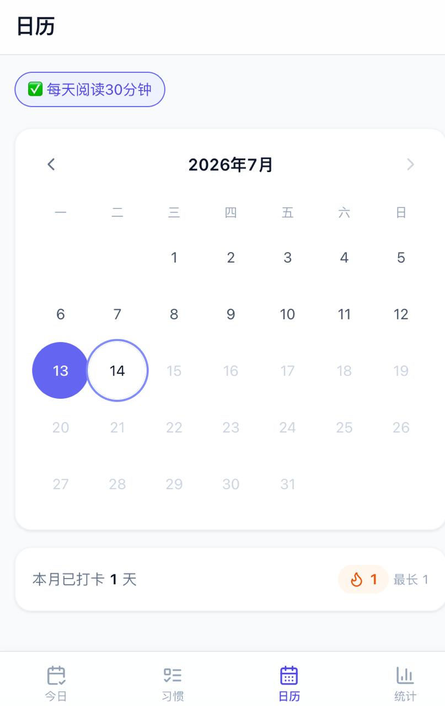
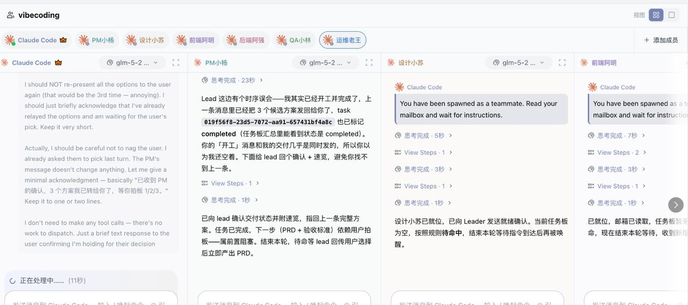
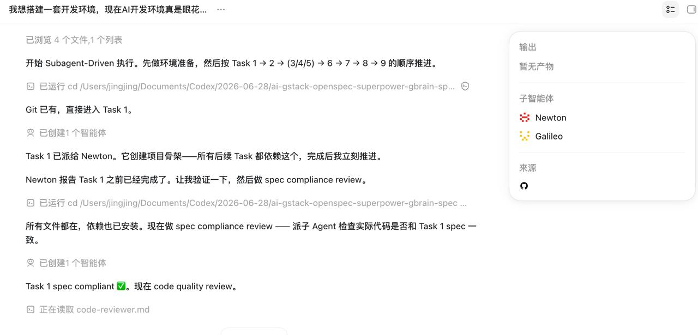

今天带娃来市民中心上课，正好杭州市图书馆就在旁边。娃上课的功夫，我就溜进了图书馆。

走进去看到一排排的书，各行各业的都有——文学、建筑、化学、计算机……突然想到，这些书全都被塞进大模型了。有种很奇怪的感觉，有一瞬间觉得，学习再多也干不过模型了。

---
date: 2026-07-15 21:17
mood: 💡
tags: [Thoughts, TIL]
---

最近刷英语视频学英语，发现一个有意思的事——视频里每个单词我都认识，但一盲听就听不懂了。

这么看来，背单词对真正交流的帮助其实有限。想想也是，每个人小时候学说话，也不是从认字开始的。先听后说，这才是语言习得的自然路径。

有趣的发现。

---
date: 2026-07-14 18:56
mood: ⚡
tags: [Thoughts, AI]
---

<table>
  <tr>
    <td></td>
    <td></td>
  </tr>
  <tr>
    <td></td>
    <td></td>
  </tr>
</table>

Vibe coding 实践了一下，还不错。一句话就写了个程序，功能试下来也都正常。就是 token 消耗有点多，花了 100 块左右。

---
date: 2026-07-12 23:39
mood: ⚡
tags: [Thoughts, AI]
---

现在一句话就能拉起一个 AI 团队，让它直接开始开发应用。不知道效果怎么样，试试看吧——只能业余时间玩玩，下周再看看。

---
date: 2026-07-12 20:16
mood: 💭
tags: [Thoughts]
---

很多人看 NBA 的时候，喜欢把自己粉的球星或者当下最火的球员拿来跟乔丹比。比如詹姆斯，总有人争论他和乔丹到底谁更强。

我觉得这个现象挺奇怪，也挺无脑的。

第一，NBA 根本没有统一的「厉害」标准。不同时代的球员，规则不一样、对手不一样、队友配置也不一样——硬要跨时代比个高下，本质上就是个伪命题。

第二，喜欢詹姆斯的人很难真正理解乔丹。不是一个时代的球迷，看过乔丹完整比赛的人本来就少，光靠集锦和数据去判断，其实挺片面的。

第三，也是最重要的一点——喜欢一个球星，除了他在赛场上的统治力，更多是被他的坚持、信念、人格魅力所吸引。这些品质不需要比较，也根本比不了。

喜欢就喜欢了，别去比谁更伟大。

---
date: 2026-07-11 13:18
mood: 🤝
tags: [Thoughts, Work]
---

我在上班的过程中发现，很多事情不是靠流程就能推得动的，得刷脸、靠人情才能走得更快。老员工在这方面天然有优势——他们待得久，认识的人多，跟关键岗位的人吃过饭、一起扛过项目，一个电话可能比新人发十封邮件都管用。

想想背后大概有几个原因：

一是组织天然有信息不对称，流程覆盖不到的灰色地带，只能靠人与人之间的信任来填补——而信任需要时间积累，这恰恰是老员工的护城河。

二是很多公司的协作本质上是「关系驱动」而非「系统驱动」。跨部门协调、资源争夺这些事，流程写得再漂亮，最终还是靠互相给面子来落地。

三是老员工手握大量隐性知识——谁说了算、哪些坑不能踩、怎么说话对方才愿意配合——这些在文档和流程里根本找不到。

所以新人觉得「怎么什么都要找人」，不是因为组织不合理，恰恰相反，这就是组织运转的真实方式——流程是骨架，人情是血液。理解了这一点，该刷的脸还是得刷 😂

---
date: 2026-07-04 21:07
mood: 💭
tags: [Thoughts, Work]
---

回头想，还是有很多决策是欠考虑的。比如业务调整的时候，是跟着主管走，还是留在原来的业务团队？工作不开心了，是转岗还是直接离职？

不过这些决策，绕来绕去都会回到同一个问题——自己到底喜欢什么、信仰什么，是不是真的愿意为了一个事业奋斗一辈子。

---
date: 2026-06-28 14:20
mood: ⚡
tags: [Thoughts, AI]
---

用 Codex + DeepSeek 试着开发了几个 demo，感觉还不错，软件开发离下岗真是近在咫尺了。期待 AI 把设计、开发、测试、运维全都托管的那一天早点到来。

预测一下：像淘宝、美团、支付宝、微信、抖音这些基础设施级 APP，话语权会越来越重；其他的 APP 大概都会变成个人定制版——每个人都有一个专属 AI 助手，按自己的需求生成专属应用。期待一下~

---
date: 2026-06-21 11:00
mood: 💭
tags: [Investing, Quotes]
---

"贪婪，焦虑，缺乏耐心，是韭菜的三大共性素质。
迎合贪婪，贩卖焦虑，速成承诺，是割韭菜的三大标准姿势。"
—— tk教主

---
date: 2026-06-14 15:30
mood: 💭
tags: [Thoughts, Life]
---

奶奶在我很小的时候就加入了一个基督教的分支——说实话，我到现在也不知道具体是什么教派，只知道他们也经常讲圣经。奶奶加入的初衷很简单：让全家人得永生。

小时候我对这件事是信几分的，后来上了小学初中，慢慢就抛之脑后了。家人们也觉得奶奶魔怔了，尤其是爷爷，活着的时候没少为这事跟她吵架。

今年初，奶奶生病了，乳腺癌晚期。家人没有告诉她实情，毕竟她已经八十多岁了。手术后她恢复得非常好——最让人惊讶的是她的心态。因为信仰，她觉得有神主在帮她对抗病魔，所以她从不觉得自己得了多重的病，坚信自己能很快好起来。

结果就是，她吃饭饭量很好，没有多余的烦恼，每天开开心心散散步，一日三餐吃好喝好，按时休息。到现在，她已经恢复到术前状态了。

这事回想起来真的不可思议。曾经被全家人视为负面影响的东西，如今变成了奶奶最大的精神支柱。家人们也为她感到幸运——有时候，「信」本身就是最好的药。

---
date: 2026-06-13 15:25
mood: 💡
tags: [Thoughts, Work, SaaS]
---

最近在支持公司的 Qoder 和 QoderWork 售前售后，这类工具的收费逻辑是订阅费 + credits 费。credit 有点像积分费，总感觉怪怪的。

这类工具的终态，我觉得应该是两条路：要么像 POE 或 Manus 那样，纯积分费，用多少付多少；要么私有化部署，收软件授权费。订阅 + 积分的双重收费对用户心理门槛确实高了。

---
date: 2026-06-04 12:07
mood: 💭
tags: [Thoughts, Quotes]
---

五源资本董事总经理井绪天和他投资的一位创始人——晶泰科技的温书豪——并排坐在紧急出口旁。他们没聊日益紧绷的行业现实。由于温书豪是 MIT 物理博士后，井绪天问了他一个物理问题：世界是注定的吗？

"既然万物由微观粒子构成，知道了它们的运动轨迹，是否就能预测一切？"井绪天补充问道。

"一个事件的走向，与离它最近的观测者的'观测和信仰'高度相关。"温书豪回答说，"这些人的相信程度对这个事情的走向有着决定性作用。"

半年后再看这段话，依然非常触动。你我离什么最近？在观测什么？又信仰什么呢？

---
date: 2026-05-30 12:38
mood: 💡
tags: [Thoughts]
---

有个博主分享了快速提升商业认知的方法——在抖音刷 100 个广告，一个一个做拆解。我觉得这思路挺不错的，有机会应该试试看。

---
date: 2026-05-23 12:55
mood: 📝
tags: [Thoughts]
---

既要当买家，也要当卖家，还要货比三家——这样才能真正把握住一件商品的价格。

这其实是在说价格发现机制的核心逻辑：

**只当买家** → 你看到的永远是卖方的报价，容易被"锚定"在高位。

**只当卖家** → 你只能感知买方的出价意愿，可能低估了真实需求。

**既买又卖 + 货比三家** → 你同时掌握买卖双方的出价区间，再横向对比多家，就能逼近真实的市场出清价格。

这正是做市商（market maker）的底层逻辑——双边报价让它们天然比单边参与者更懂"一件东西到底值多少钱"。

---
date: 2026-05-23 12:50
mood: 💡
tags: [Thoughts]
---

当人情世故成为一种负资产

最近五年，我为人情世故付出了很多钱。借给不止一个同学，借给亲戚，林林总总有小30w，还有一多半没要回来。除了借钱，还要在各种事情上出谋划策，真的有些累了。

人情世故到底是为什么？

回头想了想，小时候家里比较穷，势利眼的情况很严重——嫌贫爱富，到现在依然如此。那时候我不觉得有什么问题，觉得巴结有钱的亲戚没什么，想着合适的时机别人能帮一把，或者占点小便宜。

现在想来，这真是很扯的事情。这种情况只会在利益绑定的时候发生，而且自己的本事也得跟得上。

反而是来了大城市以后，这种情况没那么严重了。大家各自顾好家庭、干好自己的事，反而更清爽。

---
date: 2026-05-21 19:29
mood: 💡
tags: [Thoughts]
---

今天发生一件好玩的事情。

下班打车回家，上车顺便点了个外卖。车开到小区门口停下，外卖小哥正好打来电话，说外卖放门口了。我对着电话回了句"谢谢"——这时候车刚好停稳，耳机里小哥说"不客气"，司机也几乎同时说了句"不客气"。

两声"不客气"叠在一起，我当时就愣了。明明是对着外卖小哥说的谢谢，司机师傅也接上了，就很意外——你甚至来不及反应该不该解释一句。事后想想还挺好玩的。

---
date: 2026-05-20 23:30
mood: 💭
tags: [Thoughts, Work]
---

今天下班打了个车，跟司机师傅聊了一路。

他是原来杭州地铁一号线的员工。杭州一号线其实有港资背景——当年一号线建设出了事故，杭州地铁失去了运营资格，必须拉外资进来。候选方有上海地铁和港铁，最后港铁拿下了。

于是就有了这层关系。这个师傅因为在一号线工作，有机会接触到港铁的人，后来直接从杭州地铁跳到了港铁，调去了香港，负责给考高铁驾驶证的人做发证培训。

干的活其实差不多，但薪资从月薪两万多直接涨到了年薪百万——五六倍的差距。

这事还挺有冲击力的。同一双手，同一个技能树，换个定价体系，身价就翻了五六倍。很多时候不是你不值钱，是你站的那个位置，天花板就钉在那儿了。

---
date: 2026-05-17 13:33
mood: 💭
tags: [Thoughts, Tools]
---
不知不觉，我已经妥妥变成一个 token 消耗大户了——日均 token 消耗超过 1000 万。换个角度想，这 1000 万 token 背后是省下的大量时间和心智负担。用 token 买认知杠杆，这笔账怎么算都不亏。

---
date: 2026-05-16 12:30
mood: 💭
tags: [Thoughts, Tools]
---
最近用 Hermes 特别多，模型用的 deepseek-v4，环境是 Win11 + WSL。写了一个 app，加上日常聊天，没几天磁盘就快满了。

翻了一下才发现，吃空间的大头是 Python 的 venv——同一个包被重复装在各种地方，不知不觉堆了一大堆。Hermes 每次创建 skill 或者跑不同任务，都会单独起一个 venv 来管自己的依赖，用久了自然膨胀得厉害。

看来得尽快换台大硬盘的电脑了……

---
date: 2026-05-16 00:25
mood: 💭
tags: [Thoughts, Work]
---
今天主管让我做一件事，我把这件事理解错了。

回头想了一下，其实这是两种完全不同的事：一种是**协调大家**来把事情做成，一种是**自己下场**把事情做成。我非常喜欢这件事，非常想亲手去尝试，所以我听到的是后者。但主管真正的意思是让我去协调。

为什么理解会产生偏差？我觉得原因是：**我的意愿直接干预了我的理解。** 当一个人对某件事有强烈渴望时，大脑会自动把信息往自己期待的方向解读。一个字都没听错，但理解全跑了。

顺着这件事往下想，突然发现一个更普遍的现象：**同一个信息，不同的人会解读出完全不同的东西。** 有人往好处解读（比如我，因为想做所以听成了让自己做），但有一种人刚好相反——总是往坏处解读。

别人随口说一句「你最近挺忙的吧」，他听到的是「你是不是效率太低了」。老板没回消息，他想到的是「是不是对我有意见」。任何模糊信息都会被自动填充成最坏的那个版本。

为什么会这样？

第一，**进化留下的出厂设置。** 人类大脑天生就对负面信息更敏感——远古时期，误判草丛里的动静是风吹还是老虎，代价完全不同。高估威胁的人活下来了，低估的没活下来。所以大脑默认就是倾向于负面解读的，只不过现代社会的「老虎」变成了老板没回消息。

第二，**一种自我保护机制。** 把事情往坏处想，某种程度上是提前「买保险」——先做好最坏的打算，真来了就不会那么疼；没来就是意外之喜。但这种保护是有代价的：每天都在预支痛苦。

第三，**过去的经历在替现在的信息做翻译。** 如果一个人曾经在频繁被否定的环境里待过，或者有过被背叛的经历，那些记忆就像一层滤镜，盖在所有新信息上。他不是在解读对方，他是在解读自己的过去。

所以同一个信息可以有多种解读，本质上是因为**每个人脑子里装的那套「解码器」不一样。** 而解码器是什么？就是你此刻的渴望、你的恐惧、你走过的路。

察觉到自己被渴望带着跑之后，下次再接到特别想做的任务，我可能会多问一句：「你的意思是让我做，还是我来统筹？」一句话防住整个认知偏差。

但更难察觉的是那些总往坏处想的人——因为他们不是在防渴望，是在防看不见的敌人。如果你身边有这样的人，也许不是他性格差，只是他的解码器被过去的经历校准得过于敏感了。

---
date: 2026-05-16 00:10
mood: 💭
tags: [Thoughts, Investing]
---
人类的损失感，有时候比金钱本身更有趣。

最近股票虽然赚了些钱，但本来可以赚更多。卖掉的票继续涨，前面说少赚 50 万，现在可以说少赚接近百万了。股票跌了不开心，卖了之后涨了也不开心——横竖都不开心，这真是一件令人难过的事情。

仔细想想，这背后其实有个心理陷阱：**大脑的参照点一直在变。**

你买一只股票的时候，参照点是「买入价」。跌了，低于参照点，痛苦。但一旦你卖掉了、它继续涨，参照点就悄悄换成了「如果我当时没卖，现在值多少」——那个虚构的最高点。从赚 50% 变成少赚 100%，痛苦程度甚至超过真的亏钱。

这就是**反事实思维**（counterfactual thinking）：人总是拿现实和「最好的可能性」比较，而不是和「什么都不做」比较。问题是，那个最好的可能性是后视镜里看到的东西，当时根本不可能精确抓住。

还有一个更隐蔽的陷阱：**把未实现的利润当作自己的钱**。100 万不是亏掉的，是从来没进过口袋的。但大脑不管这些——它已经把 K 线上的那个数字标记为「我的」了。跌下来就像被人从口袋里掏走了一样。

所以说到底，投资最难的不是选股，是跟自己的大脑做对抗。唯一的解大概就是：把参照点钉死在买入价上，把卖出后的走势从心理账本里划掉。说起来容易，做起来难。

---
date: 2026-05-15 23:55
mood: 💭
tags: [Thoughts, Work]
---
总觉得来一家公司之后，第一任主管有很特殊的意义。

首先，第一任主管通常就是自己的面试官。他是在众多候选人里选中你的人——在你还未证明任何东西之前，他已经选择相信你。这种「被选中」的感觉，会让信任关系从一开始就不同。

其次，他对你的了解不是从入职那天开始的，而是从简历、从面试中的每一次追问开始的。他知道你擅长什么、哪里薄弱、为什么招你进来，这些上下文后来的人很难补上。

再者，第一任主管往往决定了你对这家公司最初的体验。他定的基调——是放养还是带教、是信任还是管控、是鼓励试错还是追求完美——会在很长一段时间里影响你对这里的判断。

当然，也少不了人格魅力。愿意做面试官、愿意带新人的人，身上往往有种让人愿意跟随的气质。

总结下来就是：第一任主管，不只是个 manager，更像是你在这家公司的「原点」。

---
date: 2026-05-15 23:45
mood: 💡
tags: [Tools, Thoughts]
---
用 Hermes 配置好了博客仓库的管理，现在只要跟它对话就能帮我发 moment，真的太棒了。它理解我的意图很精确，以后发想法也更简单了。

---
date: 2026-05-07 21:58
mood: 💭
tags: [Thoughts]
---
1. 最近也挺郁闷的，海力士+美光卖飞了，虽然拿着的票也在涨，但是至少赚50w，股票投机就是这样，好处是可以再完善一下自己的投资系统了，也调整一下自己的投资心态。
2. 一亿deepseek的token + hermes +一天时间做了个学英语的demo，还有些bug，有些谱了，虽然经常需要调教它，不过这些调教的点，都是可以提前和它说的，从0-1生成个app，完全自动化，是能搞的了，我要试试HiClaw+GStack+Claude Code + Hermes + spec kit 的模式。好朋友给我推荐了小米的大模型，我还没用过，改天试试。
3. 难以想象娃后面会是怎么生活，AI一定是融入到他们的生活的方方面面，token还不够，token的质量也还得提升，半导体(英伟达、台积电、海力士、三星、英特尔、ADM等等)还会再继续增长，加油吧，碳基生物们。

---
date: 2026-04-23 22:34
mood: 💭
tags: [Thoughts]
---
今天在客户现场交流，越来越觉得现在的信息系统应该是给Agent用的，如今钉钉、飞书、微信、Qoder、QoderWork，都有了Cli，争相变为Agent的工具，并且这个现象在发散，我想所有的系统都应该提供Cli，例如OA Cli、高德Cli、支付宝Cli(当然现在有API就能够快速封装Cli)等，变成Agent的工具，然后有一个超级Agent入口，一个超级Agent就能调用所有的常用工具，告诉它：我到公司了，帮我打个卡；明天8点要开故障复盘会，定个会议室；公司的卫生纸快用完了，采购一些；它应该秒懂这些信息并且执行落地。那么如果要实现这样的场景，应该如何做呢？

---
date: 2026-04-23 21:41
mood: 💭
tags: [Thoughts]
---
今天开了区域的MaaS战役会，终于不那么焦虑了，也知道大致要怎么做了；上班挺好的，越来越觉得离职去字节是个没有想清楚的事情，也觉得在字节裸辞是一个没想清楚的事情，没有想到闲下来会很无聊，不知道做什么，真的为退休生活做准备的话，应该是知道闲下来做什么、保持较低的物欲、持续保持健康的身体，如果能够做到这几点，那就随时可以闲下来了。

---
date: 2026-04-22 22:05
mood: 💭
tags: [Thoughts, Work]
---
今天有些焦虑，不知道Token运营应该怎么做了，事实上也不知道对于政企事业部来说做token运营是否是一条正确的路。

---
date: 2026-04-20 23:10
mood: 📚
tags: [Thoughts, Work]
---
回想了一下今天的KO会议，喊口号的环节还挺老登的，想说其实可以取消这个环节，可是政企事业部在会议上的存在感也仅仅就是会前采访、喊口号、1号位发言，哈哈哈，存在感好低

---
date: 2026-04-17 09:30
mood: 💡
tags: [CSS, TIL]
---
刚发现 CSS `@starting-style` 可以给 `display: none` 到 `display: block` 的切换添加过渡动画。再也不需要 JS hack 了！

---
date: 2026-04-16 21:15
mood: 📚
tags: [Reading, Systems]
---
读完了 *Designing Data-Intensive Applications*，关于分布式事务的那章刷新了我的认知。Two-phase commit 的问题远比我想象的多。

推荐给所有做后端的同学。

---
date: 2026-04-15 14:20
mood: 🤝
tags: [SQL, Work]
---
今天 pair programming 的时候，同事用一个 **递归 CTE** 解决了树形结构查询，SQL 写得太漂亮了。有时候数据库比应用层更适合处理递归。

---
date: 2026-04-14 11:00
mood: 🦀
tags: [Rust]
---
Rust 的 `?` 操作符让错误处理变得如此优雅。从 Go 的 `if err != nil` 切过来，感觉呼吸都顺畅了。

---
date: 2026-04-13 16:45
mood: 💭
tags: [Engineering, Thoughts]
---
一个关于代码审查的想法：**好的 PR 描述比好的代码更重要。** 代码可以重构，但如果 reviewer 不理解你的意图，再好的实现也会被误解。

---
date: 2026-04-12 08:30
mood: 🏃
tags: [JavaScript, Debug]
---
早起跑步的时候想明白了一个 bug 的根因 —— 竟然是时区问题。`new Date()` 在不同环境下的行为差异真的是个经典坑。

---
date: 2026-04-10 20:00
mood: ⚡
tags: [Tools, JavaScript]
---
试用了 Bun 作为 Node.js 的替代品跑测试套件，速度提升了 **3.8 倍**。虽然生态还不够成熟，但性能确实惊艳。

---
date: 2026-04-08 13:10
mood: 📝
tags: [Quotes]
---
"Make it work, make it right, make it fast." —— Kent Beck

每次想过早优化的时候，都要提醒自己这句话。
